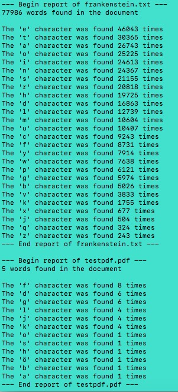

# Bookbot
Python CLI tool  to analyze the word count and letter usage in text files. Be it a simple note, a long essay, or a full fledged novel - analyze texts of all sorts and lengths!

<!--  -->

## Details
The program creates a report with the word count from each file as well as a list of letters in that file from the English alphabet and the amount of their occurrences in descending order. See below for a [sample output](#sample-terminal-output).

## Installing / Getting started
Requires python3.7+
[Get Python from python.org](https://www.python.org/downloads/)

### Fork and clone this repository to your local machine
[Fork](https://docs.github.com/en/get-started/quickstart/fork-a-repo) this repo, then clone it to your local machine:
``` shell
git clone https://github.com/YOUR-USERNAME/bookbot
```

### Place text files in the project's /texts directory
```shell
cd bookbot
mv PATH-TO-YOUR-TEXTFILE /texts
```
You can add as many files as you like - they will be analyzed in one go and be presented in alphabetical order. Please check the [supported file types](#supported-file-types) below. 

### Supported file types
Currently, the following file types are supported:
- .txt
- .docx
- .odt
- .rtf
- .md
- .mdx
- .html
- .pdf

### Run the program
From inside the project's root directory, run:
```shell
python main.py
```
Enjoy!

## Sample Terminal Output



## How to Contribute
Contributions are always welcome! Please check the [Code of Conduct](https://github.com/Sunkio/.github/CODE_OF_CONDUCT.md) .


## License
The project is licensed under the [MIT License](https://github.com/Sunkio/bookbot/License.md).

